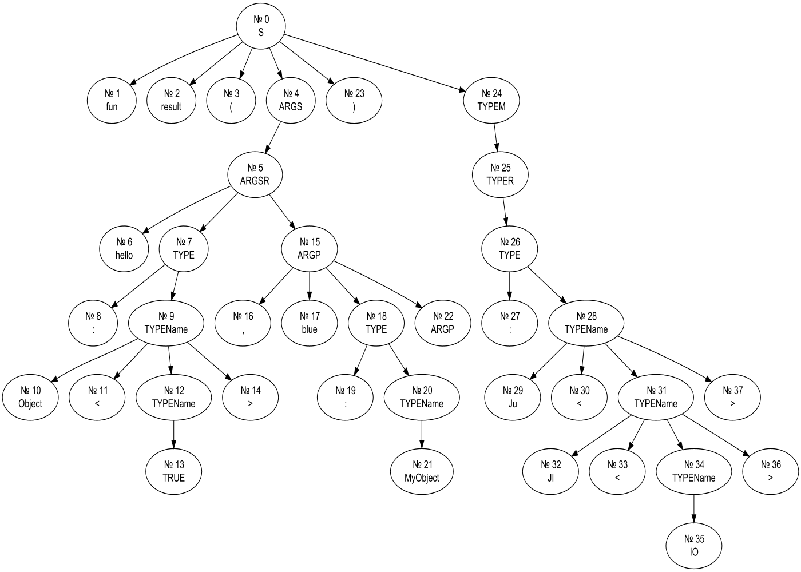

# Methods of Translation
## Lab 2 - _Вариант №9_
### Skroba Dmitri M3334

###1. Описание заголовка функции в Kotlin
Заголовок функции в Kotlin. Заголовок начинается ключевым сло-вом “fun”, далее идет имя функции, скобка, несколько описаний аргумен- тов через запятую, затем может идти двоеточие и имя возвращаемого типа.
Используйте один терминал для всех имен переменных. Используйте один терминал для ключевых слов fun и т. п. (не несколько ‘f’, ‘u’, ‘n’).

Пример: `fun printSum(a: Int, b: Int): Unit`
###2. Разработка грамматики.

В отчете будет использоваться следующие переменные:
1. `_` - один пробельный символ;
2. `name` - переменная обозначающая последовательность символов подходящую под данное регулярное выражение: `^[a-z]+[a-z,A-Z]*\b`;
3. `typeName` - переменная обозначающая последовательность символов подходящую под данное регулярное выражение: `^[A-Z]+[a-z,A-Z]*\b`.

**Grammar:**\
`S -> fun WH+ NAME ( ARGS ) TYPE?`\
`WH+ -> _ WH`\
`WH -> ε`\
`WH -> _`\
`WH -> _ WH`\
`NAME -> name`\
`ARGS -> WH`\
`ARGS -> ARG ARG+`\
`ARG -> WH NAME WH TYPE`\
`ARG+ -> ε`\
`ARG+ -> , ARG ARG+`\
`TYPE -> : WH TYPENAME WH`\
`TYPENAME -> typeName`\
`TYPE? -> WH`\
`TYPE? -> WH TYPE`

**Текущие нетерминалы:**
1. `S` - стартовый нетерминал;
2. `WH+` - нетермиинал, обозначающий непустую последовательность из пробельных символов;
3. `WH` - нетермиинал, обозначающий последовательность из пробельных символов, возможно нулевую;
4. `NAME` - нетерминал, обозначающий название функции или аргумента соответствующие регулярному выражению: `^[a-z]+[a-z,A-Z]*\b`;
5. `ARGS` - нетермиинал, обозначающий последовательность из аргументов;
6. `ARG` - нетермина, обозначающий аргумент, в виде названия аргумента и его типа;
7. `TYPE` - нетерминал, обозначающий последовательность из `:` пробельных символов и названия типа;
8. `TYPENAME` - нетерминал, обозначающий название типа соответствующие регулярному выражению: `^[A-Z]+[a-z,A-Z]*\b`;
9. `TYPE?` - нетермиинал, обозначающий либо тип, либо его отсутствие.

Приведем нашу грамматику к LL(1).

**Устраним правую рекурсию.**

_Правило из нетерминала: `ARGS` и `WB`_

`ARGS -> WH ARG'R`\
`ARGS'R -> ε`\
`ARGS'R -> NAME WH TYPE ARG+`\
`TYPE? -> WH TYPER`\
`TYPER -> ε`\
`TYPER -> TYPE`

**Добавленные нетерминалы:**
1. `ARGS'R` - обозначающий последовательность либо из пустого элемента, либо из `,` и `ARGS`;
2. `WH'R` - обозначающий последовательность либо из пустого элемента, либо из `WH`.

**Итоговые правила:**\
`S -> fun NAME ( ARGS ) TYPE?`\
`NAME -> name`\
`ARGS -> ARG'R`\
`ARGS'R -> ε`\
`ARGS'R -> NAME TYPE ARG+`\
`ARG+ -> ε`\
`ARG+ -> , NAME TYPE ARG+`\
`TYPE -> : TYPENAME`\
`TYPENAME -> typeName PAR`\
`PAR -> ε`\
`PAR -> oab TYPENAME cab`\
`oab -> <`\
`сab -> >`\
`TYPE? -> TYPER`\
`TYPER -> ε`\
`TYPER -> TYPE`

###3. Синтаксический анализатор.
1. **_First_** для нетерминалов:\
`S` - [`fun`]\
`NAME` - [`name`]\
`ARGS` - [`name`, ε]\
`ARGS'R` - [`name`, ε]\
`ARG+` - [`,`, ε]\
`TYPE` - [`:`]\
`oab` - [`<`]\
`cab` - [`>`]\
`TYPENAME` - [`typeName`]\
   `PAR` - [`<`, ε]\
`TYPE?` - [`:`, ε]\
`TYPER` - [`:`, ε]\

   1. **_Follow_** для нетерминалов:\
      `S` - [┤]\
      `NAME` - [`(`, `:`]\
      `ARGS` - [`)`]\
      `ARGS'R` - [`)`]\
      `ARG+` - [`)`]\
      `TYPE` - [`)`, `,`]\
      `TYPENAME` - [`)`, `,`, `>`]\
   `PAR` - [`)`, `,`, `>`]\
      `TYPE?` - []\
      `TYPER` - []\

###4. Тесты для парсера и лексического анализатора.

[LexicalTests](src/test/kotlin/LexicalTests.kt)
[ParserTests](src/test/kotlin/ParserTests.kt)

###5. Визуализация дерева разбора.

